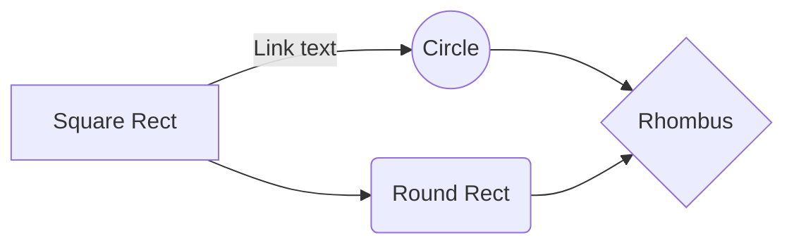

## GoAT 图表

保留了 Hugo 内建的 [GoAT](https://github.com/bep/goat) 图表支持，更多信息见 [Hugo 文档](https://gohugo.io/content-management/diagrams/#goat-diagrams-ascii)。



```goat
      .               .                .               .--- 1          .-- 1     / 1
     / \              |                |           .---+            .-+         +
    /   \         .---+---.         .--+--.        |   '--- 2      |   '-- 2   / \ 2
   +     +        |       |        |       |    ---+            ---+          +
  / \   / \     .-+-.   .-+-.     .+.     .+.      |   .--- 3      |   .-- 3   \ / 3
 /   \ /   \    |   |   |   |    |   |   |   |     '---+            '-+         +
 1   2 3   4    1   2   3   4    1   2   3   4         '--- 4          '-- 4     \ 4
```



## Mermaid 图表

额外添加了对 [Mermaid](https://mermaid.js.org/) 图表的支持，可通过特定的代码块或短代码来显示 Mermaid 图表。

> [!TIP]
> 可通过双击图表区域显示/隐藏该图表的 Mermaid 源码










sequenceDiagram
    participant Alice
    participant Bob
    Bob->>Alice: Hi Alice
    Alice->>Bob: Hi Bob




